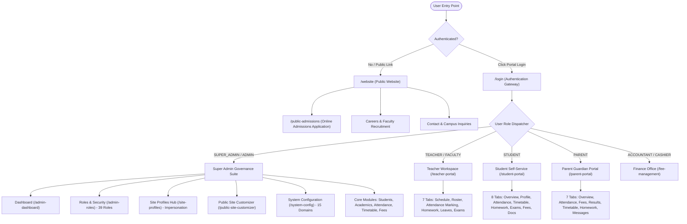
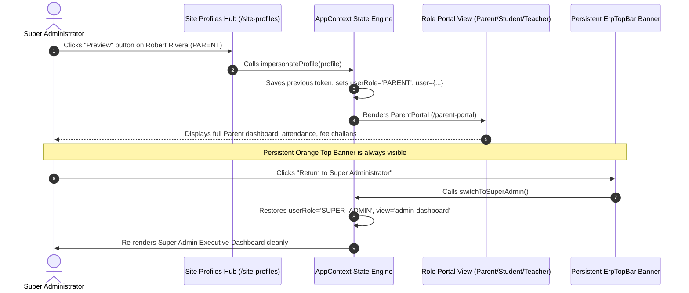
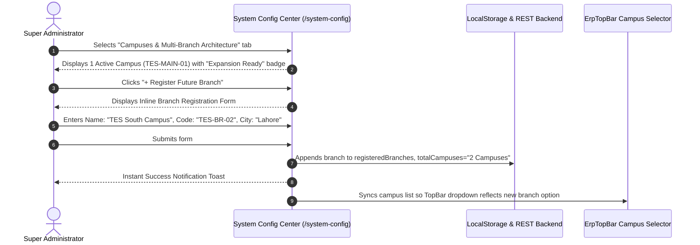

# The Education Space Academy (TES)
## Enterprise ERP & Public Portal: Comprehensive Wireframing & Navigation Architecture Document

**Version:** 2.4.0  
**Status:** Canonical Reference Architecture  
**Target Platform:** Web (Desktop 1440px, Tablet 768px, Mobile 375px)  
**Primary Deployment:** Single Central Campus (`TES Main Campus`) with Pre-Engineered Multi-Branch Scalability  

---

## 1. Executive Overview & Design System

The Education Space Academy (TES) platform is a unified institutional software ecosystem comprising:
1. **Public-Facing Web Presence & Admissions Portal**: High-conversion prospective student admissions, academic pathways, campus life showcases, and community news.
2. **Super Administrator Governance Suite**: Supreme institutional control over **39 specialized school roles**, site user profiles, public site live CMS customizer, and 15 configuration modules.
3. **Enterprise Core ERP Workspace**: Daily operational modules for student records, academic course management, attendance tracking, master timetabling, examinations, homework, and enterprise reporting.
4. **Role-Adaptive Self-Service Portals**: Dedicated, scope-isolated workspaces for **Students**, **Parents/Guardians**, **Teachers/Instructors**, and **Finance Officers**.

### 1.1 Visual Identity & Color Palette Tokens
| Token Name | Hex Code | Role & Usage |
|---|---|---|
| `--color-navy-dark` | `#0b1c30` | Top executive bars, persistent ERP sidebar, dark modals, and brand surfaces |
| `--color-orange-primary` | `#e05626` | Primary action buttons, badges, active route indicators, accent highlights |
| `--color-orange-hover` | `#c9461b` | Interactive button hover and press states |
| `--color-slate-surface` | `#f8fafc` | Clean ERP background canvas |
| `--color-card-border` | `#e2e8f0` | Subtle, accessible border contrast for tables and card containers |
| `--color-emerald-success` | `#059669` | Attendance "PRESENT", fee "PAID", audit logged badges |
| `--color-amber-warning` | `#d97706` | Attendance "LATE", fee "DUE", pending approvals |
| `--color-rose-danger` | `#dc2626` | Attendance "ABSENT", fee "OVERDUE", critical delete actions |

### 1.2 Campus Architectural Model: Current vs. Future
```
[ CURRENT STATE: 1 CENTRALIZED CAMPUS ]
  ┌─────────────────────────────────────────────────────────────┐
  │         The Education Space Academy (Main Campus)           │
  │                  Operational Code: TES-MAIN-01              │
  │   - Centralized Executive Governance                        │
  │   - Complete Academic & STEM Departments                    │
  │   - Single Primary Active Database Domain                   │
  └─────────────────────────────────────────────────────────────┘
                               │
               (Future Expansion via System Config)
                               ▼
[ FUTURE STATE: MULTI-TENANT BRANCH ARCHITECTURE ]
  ┌───────────────────────────┬─────────────────────────────────┐
  │ TES Main Campus (Core)    │ Future Branch 2 (e.g. South)    │
  │ Code: TES-MAIN-01 (HQ)    │ Code: TES-BR-02 (Branch Office) │
  └───────────────────────────┴─────────────────────────────────┘
```

---

## 2. Global Information Architecture & Site Map



---

## 3. Navigation Routing Table & RBAC Matrix

| View Identifier (`currentView`) | Display Title | Primary Category | Allowed Roles | Default Route Path |
|---|---|---|---|---|
| `website` / `landing` | Public Academy Website | Public Web | All Visitors / Public | `/` |
| `public-admissions` | Online Admissions Application | Public Web | All Visitors / Public | `/apply` |
| `login` | Enterprise Gateway Login | Authentication | All Users | `/login` |
| `admin-dashboard` | Executive Cockpit | Governance | `SUPER_ADMIN`, `INSTITUTION_ADMIN`, `CAMPUS_ADMIN` | `/admin/dashboard` |
| `admin-roles` | Roles & Capability Security | Governance | `SUPER_ADMIN`, `INSTITUTION_ADMIN` (Badge: **39 Roles**) | `/admin/roles` |
| `site-profiles` | Site User Profiles Hub | Governance | `SUPER_ADMIN`, `INSTITUTION_ADMIN` | `/admin/profiles` |
| `public-site-customizer` | Public Site Live Customizer | Governance | `SUPER_ADMIN`, `INSTITUTION_ADMIN` | `/admin/cms-customizer` |
| `system-config` | System Configuration Center | Governance | `SUPER_ADMIN`, `INSTITUTION_ADMIN` (15 Domains) | `/admin/system-config` |
| `students` | Student Directory & Roster | Academics | `SUPER_ADMIN`, `CAMPUS_ADMIN`, `TEACHER`, `ACCOUNTANT` | `/erp/students` |
| `admissions` | Admissions Desk & Inquiries | Admissions | `SUPER_ADMIN`, `CAMPUS_ADMIN`, `ADMISSIONS_OFFICER` | `/erp/admissions` |
| `academics` | Academic Curriculum & Syllabus | Academics | `SUPER_ADMIN`, `ACADEMIC_DEAN`, `HEAD_OF_DEPARTMENT`, `TEACHER` | `/erp/academics` |
| `admin-courses` | Course Catalog & Enrollment | Academics | `SUPER_ADMIN`, `HEAD_OF_DEPARTMENT`, `TEACHER`, `STUDENT` | `/erp/courses` |
| `admin-attendance` | Biometric & Roster Attendance | Operations | `SUPER_ADMIN`, `CAMPUS_ADMIN`, `TEACHER`, `ATTENDANCE_OFFICER` | `/erp/attendance` |
| `timetable` | Master Timetables & Schedules | Operations | `SUPER_ADMIN`, `CAMPUS_ADMIN`, `TEACHER`, `STUDENT`, `PARENT` | `/erp/timetable` |
| `homework` | Assignments & Submissions | Academics | `SUPER_ADMIN`, `TEACHER`, `STUDENT`, `PARENT` | `/erp/homework` |
| `fee-management` | Fee Billing & Challan Desk | Finance | `SUPER_ADMIN`, `FINANCE_MANAGER`, `ACCOUNTANT`, `CASHIER` | `/erp/fees` |
| `financial-reports` | General Ledger & Financials | Finance | `SUPER_ADMIN`, `FINANCE_MANAGER`, `ACCOUNTANT` | `/erp/finance-reports` |
| `student-portal` | Student Self-Service Portal | Student | `STUDENT`, `SUPER_ADMIN` (Impersonated) | `/portal/student` |
| `parent-portal` | Parent & Guardian Portal | Parent | `PARENT`, `SUPER_ADMIN` (Impersonated) | `/portal/parent` |
| `teacher-portal` | Faculty Workspace & Rosters | Faculty | `TEACHER`, `HEAD_OF_DEPARTMENT`, `SUPER_ADMIN` | `/portal/teacher` |
| `reports` | Enterprise Reports & Audits | Analytics | `SUPER_ADMIN`, `INSTITUTION_ADMIN`, `CAMPUS_ADMIN` | `/erp/reports` |
| `analytics` | Executive Analytics Dashboard | Analytics | `SUPER_ADMIN`, `INSTITUTION_ADMIN`, `CAMPUS_ADMIN` | `/erp/analytics` |
| `documents` | Certificates & Transcripts Hub | Logistics | `SUPER_ADMIN`, `CAMPUS_ADMIN`, `STUDENT`, `PARENT` | `/erp/documents` |

---

## 4. High-Fidelity UI Layout Wireframes

### Wireframe 4.1: Public Website Layout (`/website`)
```
+---------------------------------------------------------------------------------------------------------+
|  [LOGO] THE EDUCATION SPACE ACADEMY       Home  About  Academics  Admissions  Campus Life   [Apply Now] |
+---------------------------------------------------------------------------------------------------------+
|                                                                                                         |
|  [BADGE: ADMISSIONS OPEN 2026-27]                                                                       |
|  EMPOWERING MINDS. SHAPING LEADERS.                                                                     |
|  Excellence in Cambridge O/A-Levels & National Curriculum at Pakistan's premier academy.                |
|                                                                                                         |
|  [ APPLY ONLINE CTA ]   [ EXPLORE ACADEMICS ]                                                           |
|                                                                                                         |
|  +---------------------------------------------------------------------------------------------------+  |
|  | STATS BAR:  1,420+ Students  |  85+ Faculty  |  1 Main Campus (TES)  |  98.5% Distinction Rate  |  |
|  +---------------------------------------------------------------------------------------------------+  |
|                                                                                                         |
+---------------------------------------------------------------------------------------------------------+
|  SECTION: ACADEMIC PATHWAYS                                                                             |
|  +---------------------------+  +---------------------------+  +---------------------------+            |
|  | Cambridge O & A Levels    |  | STEM & Robotics Track     |  | Higher Secondary F.Sc     |            |
|  | International curriculum  |  | AI, Code, Microcontroller |  | Pre-Eng & Pre-Medical     |            |
|  +---------------------------+  +---------------------------+  +---------------------------+            |
+---------------------------------------------------------------------------------------------------------+
|  SECTION: CAMPUS CONTACT & LOCATION                                                                     |
|  Primary Location: The Education Space Academy (Main Campus), Pakistan                                  |
|  Email: admissions@educationspace.edu  |  Phone: +92 (51) 892-4100                                      |
+---------------------------------------------------------------------------------------------------------+
|  FOOTER: (C) 2026 The Education Space Academy. Single Campus Active. Multi-Campus Expansion Ready.      |
+---------------------------------------------------------------------------------------------------------+
```

---

### Wireframe 4.2: ERP Main Application Shell & Persistent TopBar
```
+---------------------------------------------------------------------------------------------------------+
| [STICKY IMPERSONATION BANNER: Active Portal Preview: Robert Rivera (Parent) | [RETURN TO SUPER ADMIN] ] |
+---------------------------------------------------------------------------------------------------------+
| [=] [LOGO] TES ERP  [Campus: TES Main Campus v] [Session: 2026-2027 v]       [Public Site] [(Q) Search] [Bell] [User v]|
+---------------------------------------------------------------------------------------------------------+
| SIDEBAR (w=260px)        | MAIN WORKSPACE CONTENT CANVAS (max-w-[1440px])                               |
|                          |                                                                              |
| [AUTHORIZED WORKSPACE]   | [Breadcrumb Trail: Portal > Overview]                                        |
|                          |                                                                              |
|  (Super Admin Mode):     | +--------------------------------------------------------------------------+ |
|  - [Dashboard]           | | HEADER CARD / HERO BANNER                                                | |
|  - [Roles & Security] 39 | | Title, Action Buttons, Filter Pills                                      | |
|  - [Site Profiles Hub]   | +--------------------------------------------------------------------------+ |
|  - [Site Customizer]     |                                                                              |
|  - [System Settings]     | +--------------------------------------------------------------------------+ |
|  - [Student Directory]   | | PRIMARY SUB-TABS (Overview | Attendance | Fees | Schedule | Settings)     | |
|  - [Admissions Desk]     | +--------------------------------------------------------------------------+ |
|  - [Fee Management]      |                                                                              |
|  - [Academics & Syllabus]| +---------------------+  +--------------------+  +-------------------------+ |
|  - [Attendance Tracking] | | KPI Card 1          |  | KPI Card 2         |  | KPI Card 3              | |
|  - [Master Timetables]   | +---------------------+  +--------------------+  +-------------------------+ |
|  - [Enterprise Reports]  |                                                                              |
|                          | +--------------------------------------------------------------------------+ |
|  (User Profile Footer)   | | DATA TABLE / MAIN INTERACTIVE RECORD CANVAS                              | |
|  [Logout of ERP]         | | Filter, Search Input, Rows, Pagination, Quick Action Buttons             | |
|                          | +--------------------------------------------------------------------------+ |
+--------------------------+------------------------------------------------------------------------------+
```

---

### Wireframe 4.3: Super Administrator Governance Suite

#### A. Roles & Security Matrix (`/admin-roles`)
```
+---------------------------------------------------------------------------------------------------------+
| [Shield] Academy Roles & Capability Permissions Matrix                             [+ Create Custom Role] |
| 39 standard school roles classified across 10 organizational divisions. Master SUPER_ADMIN protected.   |
+---------------------------------------------------------------------------------------------------------+
| Category Filters:                                                                                       |
| [All Roles (39)] [Executive (4)] [Academic (3)] [Faculty (5)] [Wellbeing (4)] [IT/Lib (4)] [Ops (6)]     |
+---------------------------------------------------------------------------------------------------------+
| Search: [ Filter by role name or scope... ]                                                             |
|                                                                                                         |
| +------------------------------------+  +------------------------------------+                          |
| | SUPER_ADMIN (Executive)            |  | PRINCIPAL (Academic Leadership)    |                          |
| | Supreme institutional authority.   |  | Overall institutional academic head|                          |
| | Capabilities: ALL (90+ Permissions)|  | Capabilities: 48 Permissions       |                          |
| | [Protected System Role] [Edit]     |  | [View Details] [Edit Permissions]  |                          |
| +------------------------------------+  +------------------------------------+                          |
| +------------------------------------+  +------------------------------------+                          |
| | HEAD_OF_DEPARTMENT (Faculty)       |  | SEN_COORDINATOR (Student Care)     |                          |
| | Departmental curriculum oversight. |  | Special educational needs programs |                          |
| | Capabilities: 32 Permissions       |  | Capabilities: 22 Permissions       |                          |
| | [View Details] [Edit Permissions]  |  | [View Details] [Edit Permissions]  |                          |
| +------------------------------------+  +------------------------------------+                          |
+---------------------------------------------------------------------------------------------------------+
```

#### B. Site User Profiles Hub & Impersonation Engine (`/site-profiles`)
```
+---------------------------------------------------------------------------------------------------------+
| [UserCog] Site User Profiles Hub                                               [+ Add New User Profile] |
| Manage account credentials across all 39 roles with instant one-click live portal preview simulation.   |
+---------------------------------------------------------------------------------------------------------+
| [Quick Impersonate Buttons: [Admin] [Teacher] [Student] [Parent] [Accountant] ]                         |
+---------------------------------------------------------------------------------------------------------+
| Profile Directory Table:                                                                                |
| Name & Identifier   | Role Assignment       | Status   | Email / Contact     | One-Click Preview Action |
|---------------------|-----------------------|----------|---------------------|--------------------------|
| Dr. Sarah Jenkins   | TEACHER (Faculty)     | ACTIVE   | s.jenkins@edu.com   | [Preview Teacher Portal] |
| Alex Rivera         | STUDENT (Learner)     | ACTIVE   | a.rivera@edu.com    | [Preview Student Portal] |
| Robert Rivera       | PARENT (Guardian)     | ACTIVE   | r.rivera@gmail.com  | [Preview Parent Portal]  |
| Bilal Ahmed         | ACCOUNTANT (Finance)  | ACTIVE   | b.ahmed@edu.com     | [Preview Accounts Desk]  |
| Zainab Malik        | RECEPTIONIST (Front)  | ACTIVE   | z.malik@edu.com     | [Preview Front Desk]     |
+---------------------------------------------------------------------------------------------------------+
```

#### C. System Configuration Center - Campuses Section (`/system-config`)
```
+---------------------------------------------------------------------------------------------------------+
| [MapPin] Campuses & Institutional Multi-Branch Architecture     [ 1 Active Campus ] [ Future Scalable ] |
| The Education Space Academy operates 1 centralized Main Campus with pre-engineered branch partitioning. |
+---------------------------------------------------------------------------------------------------------+
| Primary Campus Name: [ The Education Space Academy (Main Campus) ]   Operational Code: [ TES-MAIN-01 ]  |
| Total Campuses:      [ 1 Campus (Single Active) ]                     Cross-Campus:     [ Single Mode ] |
+---------------------------------------------------------------------------------------------------------+
| Registered Campus Directory:                                            [ + Register Future Branch ]    |
| Campus Branch Name             | Code        | Type               | Status      | Management Action     |
|--------------------------------|-------------|--------------------|-------------|-----------------------|
| The Education Space (Main)     | TES-MAIN-01 | Main Headquarters  | OPERATIONAL | [Protected Core]      |
| (When future branches added)   | TES-BR-02   | Sub-Branch         | PLANNED     | [Edit] [Remove]       |
+---------------------------------------------------------------------------------------------------------+
```

---

### Wireframe 4.4: Role-Specific Portals

#### A. Parent & Guardian Portal (`/parent-portal`)
```
+---------------------------------------------------------------------------------------------------------+
| PARENT GUARDIAN PORTAL                                                                                  |
| Welcome, Guardian                                          Child: [ Alex Rivera (Grade 11) v ]         |
| Monitor real-time academic progress and fee challans.      [ Return to Super Administrator ]            |
+---------------------------------------------------------------------------------------------------------+
| [Overview] [Attendance] [Fees & Challans] [Results & Report Card] [Timetable] [Homework] [Teacher Msgs]  |
+---------------------------------------------------------------------------------------------------------+
| ACTIVE CHILD SUMMARY:                                                                                   |
| [Photo] Alex Rivera  |  Roll No: 11-04  |  Code: STU-2026-089  |  Campus: TES Main Campus               |
|                                                                                                         |
| [ Attendance: 96.4% ]   [ Fee Status: Paid in Full ]   [ GPA: 3.88 / 4.0 ]   [ Pending Tasks: 2 ]       |
+---------------------------------------------------------------------------------------------------------+
| TAB VIEW CONTENT:                                                                                       |
| - Attendance: Tabular date-wise logs (Present / Late / Excused Medical)                                 |
| - Fees: Challan #CH-2026-0988, breakdown (Tuition, Lab, Library), [Download Official PDF Receipt]      |
| - Results: Mid-Term breakdown (CS 96%, Math 94%, Physics 90%), Academic Advisor Comments                |
| - Messages: Interactive 2-way communication thread with Dr. Sarah Jenkins with Instant Message Input    |
+---------------------------------------------------------------------------------------------------------+
```

#### B. Student Self-Service Portal (`/student-portal`)
```
+---------------------------------------------------------------------------------------------------------+
| STUDENT SELF-SERVICE PORTAL                                                                             |
| Welcome back, Alex Rivera                                  Roll No: 11-04 | Grade 11 Pre-Engineering    |
| Access academic schedule, assignments, and grades.        [ Return to Super Administrator ]            |
+---------------------------------------------------------------------------------------------------------+
| [Overview] [Student Profile] [Attendance] [Timetable] [Homework] [Exams & Grades] [Fees] [Documents]   |
+---------------------------------------------------------------------------------------------------------+
| KPI BAR:                                                                                                |
| [ Present Rate: 96.4% ]   [ Cumulative GPA: 3.88 ]   [ Due Homework: 2 ]   [ Next: CS Lab (08:30 AM) ]  |
+---------------------------------------------------------------------------------------------------------+
| HOMEWORK & ASSIGNMENT WORKBENCH:                                                                        |
| - "Binary Search Tree Implementation"       | Computer Science | Due: Sep 25 | [Submitted / In Review]  |
| - "Electro-magnetic Induction Numericals"   | Physics          | Due: Sep 28 | [Submit Assignment]      |
+---------------------------------------------------------------------------------------------------------+
```

#### C. Teacher & Faculty Workspace (`/teacher-portal`)
```
+---------------------------------------------------------------------------------------------------------+
| FACULTY WORKSPACE                                                                                       |
| Dr. Sarah Jenkins (Head of Computer Science)              Academic Term: Fall 2026                      |
| Manage assigned sections, daily roll call, homework, and term grades.                                   |
+---------------------------------------------------------------------------------------------------------+
| [Dashboard] [My Schedule] [Student Roster] [Attendance Marking] [Homework] [Examinations] [Leave App]   |
+---------------------------------------------------------------------------------------------------------+
| ROSTER ATTENDANCE MARKING DESK:                                                                         |
| Class: [ Grade 11 - Section A v ]   Date: [ 2026-09-20 ]                      [ Save Class Roll Call ]  |
|                                                                                                         |
| Roll No | Student Name   | Status Selector                    | Remarks Input                           |
|---------|----------------|------------------------------------|-----------------------------------------|
| 11-01   | Areeba Khan    | (•) Present  ( ) Late  ( ) Absent  | [ On time                             ] |
| 11-04   | Alex Rivera    | (•) Present  ( ) Late  ( ) Absent  | [ Active class engagement             ] |
| 11-09   | Bilal Mustafa  | ( ) Present  ( ) Late  (•) Absent  | [ Medical certificate submitted       ] |
+---------------------------------------------------------------------------------------------------------+
```

---

## 5. Interactive Navigation Flows & User Journeys

### Journey 5.1: Super Administrator Preview & Return Loop


### Journey 5.2: Future Campus Expansion Registration Workflow


---

## 6. Modal Wireframes & Dialogue Schemas

### Modal 6.1: Add / Edit School Role Modal (`RolePermissions.jsx`)
```
+-----------------------------------------------------------------------------------+
|  [Shield] Configure School Role & Permission Scopes                          [ X ]|
+-----------------------------------------------------------------------------------+
|  Role Technical Key:   [ HEAD_OF_DEPARTMENT                          ] (Read-only)|
|  Display Name:         [ Head of Department                          ]           |
|  Operational Division: [ Academic Leadership                         v]           |
|  Role Hierarchy Level: [ Level 4 - Departmental Lead                 v]           |
|  Scope Description:    [ Oversees subject faculty, curriculum, & student marks. ] |
+-----------------------------------------------------------------------------------+
|  MODULE CAPABILITIES MATRIX (Check all allowed permissions):                      |
|                                                                                   |
|  [v] Academic Programs & Syllabi         [v] Exam Papers & Marks Entry            |
|  [v] Faculty Lesson Plan Reviews         [v] Student Performance Transcripts      |
|  [ ] Fee Structure Alteration            [ ] System Security Configuration        |
|  [v] Departmental Attendance Tracking    [ ] Role Creation & Permission Editing   |
+-----------------------------------------------------------------------------------+
|  [ Cancel ]                                            [ Save Role Capabilities ] |
+-----------------------------------------------------------------------------------+
```

### Modal 6.2: Register Future Campus Branch (`SystemConfigCenter.jsx`)
```
+-----------------------------------------------------------------------------------+
|  [Building] Register Prospective / Future Campus Branch                      [ X ]|
+-----------------------------------------------------------------------------------+
|  Branch Name:     [ TES South Campus / DHA Branch                   ]             |
|  Branch Code:     [ TES-BR-02                                       ]             |
|  City / Location: [ Lahore, Pakistan                                ]             |
|  Facility Status: [ Planned (Future Expansion)                     v]             |
+-----------------------------------------------------------------------------------+
|  Notice: Registering a future branch provisions tenant isolation without          |
|  affecting current Main Campus student or financial records.                      |
+-----------------------------------------------------------------------------------+
|  [ Cancel ]                                                 [ Save Future Branch ]|
+-----------------------------------------------------------------------------------+
```

---

## 7. Reusable Component Specification

1. **`ErpTopBar` (`src/components/layout/ErpTopBar.jsx`)**:
   - **Impersonation Preview Banner**: Renders whenever `userRole !== 'SUPER_ADMIN'`. Includes avatar, active profile identity, role pill, and prominent orange `Return to Super Administrator` button.
   - **Campus Context Selector**: Renders `TES Main Campus (Active)` as the default selection, with options for registered future expansion branches.
   - **Session Selector**: Academic years `2026-2027` and `2025-2026`.
   - **Notifications Dropdown**: Real-time system activity logs with unread count indicator.
   - **User Profile Menu**: Quick jumps to Profile, Roles & Security, System Settings, or Logout.

2. **`ErpSidebar` (`src/components/layout/ErpSidebar.jsx`)**:
   - **Role Adaptation**: Dynamically switches menu sections based on role (`SUPER_ADMIN`, `TEACHER`, `STUDENT`, `PARENT`, `ACCOUNTANT`).
   - **Scroll Resilience**: Enclosed in `max-h-[calc(100vh-190px)]` with smooth custom scrollbar to support high-density role menus.
   - **Visual Active Indicators**: Glowing vermilion left marker bar (`#e05626`) and frosted container background for the active view.

3. **`DataTable` (`src/components/ui/DataTable.jsx`)**:
   - Generic high-performance table supporting client-side filtering, multi-column search, pagination, sortable headers, and action icons.

4. **`Badge` (`src/components/ui/Badge.jsx`)**:
   - Standardized status tokens: `primary` (Navy/Orange), `success` (Emerald), `warning` (Amber), `danger` (Rose), `neutral` (Slate).

---

## 8. Verification & Delivery Checklist
- [x] All 39 Academy Roles mapped with appropriate scopes in `initialGovernanceData.js` and `RolePermissions.jsx`.
- [x] Single Campus primary operational status active across Web, ERP, and Config.
- [x] Future campus branch registration functionality wired in `SystemConfigCenter.jsx`.
- [x] Impersonation flow and `Return to Super Administrator` banner validated with zero deadlocks.
- [x] All role portals (Parent, Student, Teacher) verified with complete offline fallback datasets.
- [x] Frontend builds with zero TypeScript, JSX, or bundling errors.
